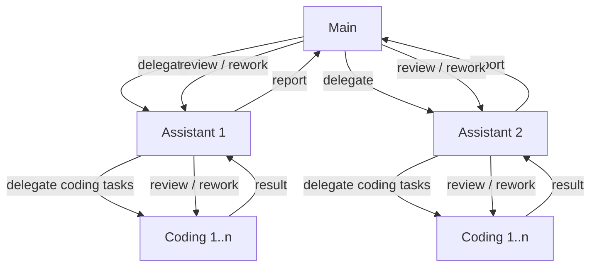
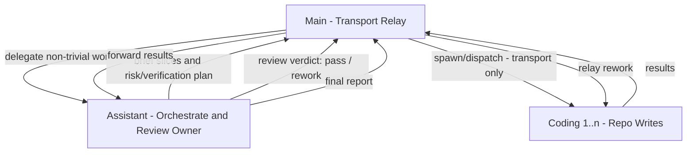

# Codex Multi-Agent Protocol: Role Constraints and an End-to-End Execution Loop

This exploration brought back a kind of excitement I hadn't felt in a while: every experiment pushed into a boundary I didn't expect. AI makes us move faster, but it doesn't understand the world on our behalf. Learning and curiosity are still part of what makes us who we are. If you're willing, treat this as an engineering notebook, and read it slowly.

## TL;DR

- A three-layer loop: the decision layer freezes goals and acceptance criteria; the orchestration layer slices work and runs review/rework; the execution layer only writes to the repo and self-checks. Mapping: decision layer = Main, orchestration layer = Assistant, execution layer = Coding.
- Write isolation: Main/Assistant never write implementation directly; repository writes come only from Coding.
- Make the protocol an engineering system: role stamps + schemas + `blocked`/`blocking_reason` semantics turn drift into explicit blocks, not "close enough".
- Freeze decisions: SSOT + Dispatch Preflight lock goal/constraints/acceptance; ambiguity raises `decisions_needed`.
- Runtime capabilities might not match the ideal topology: when `nested spawn` isn't available, use `main_router` so Main acts as a Transport Relay while Assistant retains review/rework authority.
- Parallelism needs a metronome: `spawn-first -> wait-any -> review -> replenish`, no `wait-all` barriers, and never proactively terminate unfinished agents.

Everything used in this post (AGENTS.md, schemas, and the protocol test methodology) is hosted at https://github.com/hack-ink/codex-playbook. You can fork it and build your own Multi-Agent workflow on top.

---

## Background and Motivation

1. **Maximize parallelism to increase throughput**: slice "code writing" work and run as much as safely possible in parallel, so waiting time collapses.
2. **Put the high-throughput Coding model where it shines**: OpenAI's own data says GPT-5.3-Codex-Spark can output **>1000 tokens/sec** under the right setup (https://openai.com/index/introducing-gpt-5-3-codex-spark/). But it's a smaller variant; it's usually weaker on complex decisions and long-chain reasoning than a flagship model. That naturally suggests a combo: Spark as the Coding executor, a stronger model as Assistant/Main for slicing, review, and arbitration.
3. **Personal curiosity**: how far can Codex Multi-Agent be engineered, given real runtime constraints?

## Role Layering and Responsibility Boundaries: Main / Assistant / Coding

If you treat an LLM as a "drifting runtime", a single agent tends to take on everything at once: decisions, decomposition, implementation, and review. Parallelism collapses into serial work, and scope/role drift becomes much more likely (especially when the root thread "just quickly" edits code).

Splitting into three roles is the minimal isolation that keeps the system parallel and stable:

- **Main**: architecture/strategy decisions and final acceptance; freezes SSOT so the direction doesn't change mid-execution.
- **Assistant**: slices tasks, schedules parallel work, runs the review/rework loop; hands "coding-ready briefs" to Coding.
- **Coding**: performs repository writes and self-checks only; throughput-first, ideal for Spark-like high-speed models.

## Problems and Constraints

I model Codex Multi-Agent as a "drifting runtime": you can write rules as hard as you want, but if the execution chain still contains implicit decisions, unobservable state, or no reliable feedback loop, some parallel run will go off the rails. Conversely, once you turn key control points into structured inputs/outputs, and turn deviations into explicit blocks, the system can keep moving even as runtime constraints change.

This protocol insists on two invariants:

- **Responsibility chain**: ownership must be stable, or the system drifts.
- **Transport chain**: who can spawn whom and who can message whom must match runtime reality, or the system breaks.

When both hold, you can reliably get: **high parallelism, reproducibility, and a closed review/rework loop**.

---

## Execution Model: Responsibility Chain / Nested Hierarchy + Review Loop

The ideal shape is: Main handles architecture/arbitration, Assistant handles orchestration + review, Coding handles implementation writes. Every layer reviews the layer below and can assign rework, forming a recursive closed loop.

The value isn't "it looks like an org chart". The value is that it naturally isolates three contexts:

- Architecture and boundary decisions: Main
- Task slicing, risk plan, review criteria: Assistant
- Implementation and self-checks: Coding

Topology sketch:



Everything in the rest of this post exists to keep that responsibility chain executable under real runtime constraints.

---

## Protocol Essentials: Turning Collaboration into Engineering

This section is the closest thing to "research notes" from real debugging: I wanted to just max out parallelism and hard-code the role split, but it quickly became clear that "verbal agreements" and "a good prompt" aren't stable enough. So I reversed the order: make the system observable, blockable, and loopable first; then talk about throughput.

A common failure mode in Multi-Agent is starting with "run parallelism hot" and "pick models". My experience is the opposite: without observable signals, explicit failure/block semantics, and a real review/rework loop, higher throughput just amplifies deviations.

### 0) Research Process: From Assumptions to Convergence

To avoid abstract "best practices", I'm going to state the key turning points as: **assumption -> observation -> conclusion**.

- Assumption: permission governance (e.g., making Main read-only) can prevent unauthorized writes.
  Observation: read-only limits the capability set, not the behavior. It also cuts off necessary write operations like `fmt`, auto-fix, and `git`, so the workflow often stalls at step one. A typical example: "run one round of formatting", immediately refused:

    ```text
    cargo fmt
    # -> This is a write operation; I can't execute it right now.
    ```

    Conclusion: read-only can be a safety baseline, but it can't be the main governance strategy. Governance must come from protocol + loop semantics: drift becomes a block, and blocks force explicit rework.

- Assumption: a heavy gate/wrapper can force the workflow to be correct.
  Observation: here, "gate/wrapper" means a forced entry script: instead of letting the agent spawn/edit directly, you require all dispatch and writes to go through this wrapper. The wrapper tries to front-load constraints as hard gates: validate Dispatch Preflight JSON, inject Role Stamps, enforce `allowed_paths`, validate output schemas, trigger `fmt/test`, and refuse to proceed on failure.

    For example (schematic): generate `preflight.json`, then only allow execution via the gate:

    ```sh
    dispatch_gate --workdir /abs/repo --preflight preflight.json \
      --validate-schema ~/.codex/dispatch-preflight.schema.json \
      --after "cargo test"
    ```

    This kind of gate is great in a deterministic runtime, but actual execution still depends on Codex's runtime scheduling. Even if the gate is perfect, the agent may not call it or follow it. At that point the gate doesn't enforce correctness; it becomes an extra failure surface. And the more script-like your prompt becomes, the easier it is to get policy false positives, which get amplified under parallelism.

    For example:

    ```text
    Invalid prompt: your prompt was flagged as potentially violating our usage policy.
    ```

    Conclusion: keep validation, but don't bet workflow correctness on a heavy gate. The higher-leverage investment is `prompt engineering`: write role boundaries, SSOT, and acceptance criteria into every delegated prompt, then combine structured outputs with Fail-Closed Review so deviations become diagnosable blocks and repeatable rework loops.

- Parallelism: even if routing is correct, "waiting strategy" can collapse parallelism back into serial work.
  Observation: common misreads of wait-any are "no result this tick means everyone is done" and "close unfinished agents to free slots". Both flatten parallelism or produce half-results.
  Conclusion: hard-code the metronome as `spawn-first -> wait-any -> review -> replenish`, and explicitly forbid proactively terminating unfinished agents. (There's a dedicated section later on wait-any vs wait-all.)

My typical order of operations:

1. Observability + failure semantics first: schemas + `blocked` semantics + minimal validation tooling, so failures become structured state instead of narrative.
2. Freeze the entry: SSOT/Preflight + Role Stamps, so implicit design decisions get pushed out of execution-time.
3. Only then tune scheduling/routing: spawn-first/wait-any/replenish, so parallelism becomes a default behavior rather than an accident.

### 1) Protocol Entry: From "Chat Rules" to an Inheritable File

The first problem is painfully practical: rules written only in chat are easy to lose. You explain it clearly in this thread; you open a new thread or spawn a new agent, and it snaps back to default behavior. Writing the rules into `AGENTS.md` is like placing an "inheritable collaboration manual" at the directory root; everything that follows runs with the same boundaries.

Strictly speaking, this could also be packaged as a skill. I didn't do that because, for me, parallelism is a first-class citizen: I want the rules to be on by default and inherited by default, not something I have to remember to "load" every time. If you prefer the skill shape, you can package the protocol as a skill verbatim.

- Put the protocol into `AGENTS.md` (for example, centralized at `~/.codex/AGENTS.md`) so it's inherited and reusable by default.
- Make the orchestrator rules painfully explicit: Main/Assistant/Coding roles, delegation priorities, scope boundaries.

### 2) Output Contract: No Structured Output, No Scalable Review

If you want "the parent reviews the child until satisfied", you need review at scale. Otherwise, review becomes "read a long blob and vibe-check it", which is essentially non-executable under parallelism.

Once schemas exist, you must also define dispatch and reporting. Otherwise parallelism collapses because everyone ships results in a different format.

- Start with minimal structured output schemas.
- Update dispatch and reporting rules so dispatch and reporting have one consistent shape.
- Define failure semantics for schema validation: you don't "keep going"; you block.
- Split assistant/coding output semantics, and make `blocked`/`blocking_reason` required.
- Add `check-agent-output.py` to turn schema validation from a manual ritual into a command.
- Split assistant output schemas into write/`read_only`, so "execution reporting" and "read-only review" aren't mixed into one interface.

The convergence point here is **Fail-Closed Review**: block rather than "false-pass". In Multi-Agent systems, the most dangerous outcome isn't failure; it's a false pass. Once a bad payload is accepted, every downstream decision is built on an illusion.

- Assistant must validate schema first, then do semantic review.
- If schema is incomplete, return `awaiting_review + blocked=true` with a reproducible `blocking_reason` (don't "keep going").
- Any pass verdict must reference a schema-complete coding payload; no filling in missing fields by guesswork.

### 3) Routing Constraints: Parallelism and Delegation Can't Rely on Self-Discipline

"Main never writes implementation" and "if it can be parallel, it should be parallel" will be swallowed by real execution unless you also define routing + evidence fields. My approach is to make "you should have delegated but didn't" a detectable state, and require an enumerable reason; otherwise it's a protocol violation.

- Add dispatch gate enforcement so routing rules become checkable logic.
- Strengthen proactive delegation and fallback logging: if you didn't parallelize, you must give an enumerable reason.

### 4) Freezing Decisions: SSOT / Preflight as the Anti-Drift Foundation

This was another key turning point. The most dangerous drift in Multi-Agent isn't "a bug in code"; it's "silently changing the problem". If execution-time still allows implicit design decisions, parallel work will fork fast and only converge when you try to merge and realize you built different things.

- `Dispatch Preflight`: before Main delegates any non-trivial work, SSOT (goal/non_goals/constraints/acceptance_criteria/decisions) must be written as a structured object.
- `SSOT frozen during execution`: execution doesn't get to change the goal silently; new decisions must block with `decisions_needed`.
- Promote this from text to a checkable interface: introduce `dispatch-preflight.schema.json`.
- Add routing details and examples so "who dispatches, who reviews, who writes" is unambiguous.

<details>
<summary>Dispatch Preflight / SSOT Minimal Skeleton</summary>

```json
{
	"ssot_id": "sso-YYYY-MM-DD-<short>",
	"ssot": {
		"goal": "...",
		"non_goals": ["..."],
		"constraints": ["..."],
		"acceptance_criteria": ["..."],
		"decisions": ["..."]
	},
	"routing_mode": "main_router",
	"subtasks": [
		{
			"task_id": "...",
			"subtask_id": "...",
			"delegate_target": "assistant",
			"allowed_paths": ["/abs/path"]
		}
	],
	"scheduler_plan": "spawn-first -> wait-any -> review -> replenish"
}
```

</details>

---

## Routing and Transport: Per-Agent Config and `main_router` Relay

### Per-Agent Config Brings "Role Heterogeneity" Back Inside

Before Codex v0.103, internal subagents couldn't be configured per role (model/config). To make Coding use Spark while orchestration/arbitration used a stronger model, I had to run Coding externally via `codex exec`. Architecturally it's redundant, but it solved the hard requirement at the time: role heterogeneity.

But the cost of an external `codex exec` chain is real: output return paths, schema alignment, and error/exit semantics turn the glue layer into a new failure surface. A typical incident is: the task didn't fail, the call chain did.

Example (screenshot of the external `codex exec` approach in action): https://x.com/acg_box/status/2022724226239893764

<details>
<summary>The `codex exec` override snippet at the time (to isolate Coding from the internal default config)</summary>

```sh
codex exec \
  --sandbox danger-full-access \
  --cd /abs/trusted/repo \
  --ephemeral \
  --output-schema ~/.codex/agent-output.coding.schema.json \
  -o /tmp/coding-output.json \
  -m gpt-5.3-codex-spark \
  -c 'model_reasoning_effort="xhigh"' \
  "<coding prompt>"
```

</details>

Evidence: a real failure chain:

```text
Warning: no last agent message; wrote empty content to /dev/fd/4
... invalid_json_schema ... Missing 'task_id'
... codex exec failed (exit 1)
```

The painful part is that business logic didn't change at all, yet you're debugging protocol/glue, not implementation.

With v0.103 introducing configurable Subagent Profiles / Per-Agent Config, this problem is solved: you can spawn different role profiles internally, and role heterogeneity moves back into internal Multi-Agent.

Key landing points for the internal migration included: introducing `[agents] max_threads`, per-role config files for Assistant/Coding, and writing parallelism facts into output fields (e.g. `coding_subtask_ids`, `parallel_peak_inflight`).

<details>
<summary>Per-Agent Config Sketch</summary>

```toml
[agents]
max_threads = 24

[agents.assistant]
description = "Assistant orchestrator profile for non-coding delegation, review, and reporting."
config_file = "./agents/assistant.toml"

[agents.coding]
description = "Coding executor profile for repository implementation writes only."
config_file = "./agents/coding.toml"
```

</details>

### Why I Configure Models and Reasoning Effort This Way (My Current Baseline)

This protocol assumes "responsibility isolation": different roles need different capabilities, so I configure different models and reasoning effort per agent, and let each do what it's best at.

- Main: `gpt-5.2` + `xhigh`
  I treat it as the "chief / arbitration layer": broader knowledge, steadier decisions, better at hard trade-offs. It's slow, but that's fine because it doesn't implement; it sets direction and does final acceptance. More importantly, on real engineering-heavy complex tasks (cross-module, multi-objective trade-offs, uncertainty), its depth and global reasoning are, in my experience, meaningfully stronger than the more implementation-centric `gpt-5.3-codex`.
- Assistant: `gpt-5.3-codex` + `high`
  Orchestration and review need engineering intuition and speed. I intentionally avoid `xhigh`: `high` tends to be smoother, and a number of reports suggest Codex models in `xhigh` can overthink and backtrack (https://www.reddit.com/r/ClaudeAI/comments/1qxr7vs/gpt53_codex_vs_opus_46_we_benchmarked_both_on_our/).
- Coding: `gpt-5.3-codex-spark` + `medium`
  Spark is a high-throughput executor, and it shouldn't "think too much". My experience is that Spark in `high/xhigh` tends to spend longer simulating and revising; even with high token throughput, total wall-clock time grows. `medium` behaves like "produce a reviewable version quickly": if something is unclear, return early and let a smarter Assistant/Main steer the next iteration.

<details>
<summary>Config Snippet (Example)</summary>

```toml
# ~/.codex/config.toml (Main)
model = "gpt-5.2"
model_reasoning_effort = "xhigh"

# ~/.codex/agents/assistant.toml
model = "gpt-5.3-codex"
model_reasoning_effort = "high"

# ~/.codex/agents/coding.toml
model = "gpt-5.3-codex-spark"
model_reasoning_effort = "medium"
```

</details>

In the same phase, there were two more changes that made the protocol feel more like an interface:

- Role stamps and role enforcement: missing role headers block immediately, so agents don't "accidentally" think they are Main.
- Removing "reasoning-effort overrides" from the Coding wrapper, so policy doesn't scatter across scripts; role config becomes the source of truth.

These sound like protocol neat-freakery, but they solve a very real problem: roles drift over multi-round execution (the root thread "just writes", a subagent assumes it can arbitrate). Once role stamps become a hard block, misalignment becomes diagnosable instead of implicit drift.

<details>
<summary>Minimal Role Stamp Templates</summary>

```text
[ROLE:MAIN] [PARENT:NONE]

[ROLE:ASSISTANT]
[PARENT:MAIN]
[SSOT_ID:<id>]

[ROLE:CODING]
[PARENT:MAIN_ROUTER]
[SSOT_ID:<id>]
[ROUTING_MODE:main_router]
```

</details>

### Reality Constraint: `nested spawn` Is Not Available

Reality hits quickly: nested subagents aren't available, so Assistant can't spawn Coding.

The responsibility chain can remain ideal, but the transport chain must change.

### `main_router`: Main Is Only a Transport Relay; Review Authority Stays with Assistant

When nested spawn isn't available, the workaround is relay: Main forwards messages between Assistant and Coding.
This is architecturally redundant too, but until `nested spawn` is supported, it's necessary.

The key is: don't let relay degrade into a "Main single-thread bottleneck". The design of `main_router` is:

- Main does transport only.
- Assistant owns review/rework decisions.
- Use the parallel scheduling metronome to avoid serializing.

If Main does semantic review while relaying, the system collapses into a single-thread bottleneck (Main stares at every result) and parallelism disappears.

The protocol shape here converged to:

- Introduce `main_router` compatibility and schema alignment.
- Delete multi-mode routing and converge to `main_router` only.

`main_router` topology: separating "responsibility chain" from "transport chain"



---

## Concurrency Scheduling: `spawn-first -> wait-any -> review -> replenish`

In Multi-Agent, parallelism isn't "open more agents". It's "keep refilling the window". A runnable metronome looks like this:

- Spawn as many independent runnable slices as you safely can (spawn-first)
- Use `wait-any` to wait only for the *first completion event*, then immediately review
- If review passes, replenish the window with the next runnable slice; if review fails, enter the rework loop
- Before the runnable queue is empty, do not introduce a `wait-all` barrier

Two "counterintuitive but must be hard-coded" lines:

`wait-any` does not mean "don't wait". It means "wait for the first completion event", then keep moving.

Before the runnable queue is empty, do not introduce any `wait-all` barrier.

### `wait-any` vs `wait-all`: Definitions, Trade-offs, and How I Converged on It

First, clarify the concepts. They're not necessarily one API name; they're **scheduling modes**:

- **wait-all**: global wait / batch barrier. Spawn a batch, then wait for *all* of them to finish before you start review/summarize and decide the next batch.
- **wait-any**: event-driven / pipeline mode. Spawn up to the window limit; whenever any one finishes, immediately review that result and spawn the next runnable slice.

Why I choose wait-any:

- **Less head-of-line blocking**: slices have uneven runtime. wait-all is held hostage by the slowest slice; faster slices "idle" in the queue. That's parallel in name and serial in behavior.
- **Earlier error exposure, faster rework loops**: the most expensive thing in Multi-Agent is "wrong, but discovered late". wait-any pulls review/rework earlier.
- **Easier to make parallelism real**: parallelism isn't "open N once". It's "keep replenishing". wait-any turns `spawn-first -> wait-any -> review -> replenish` into a stable rhythm.

When to use wait-all: only when the runnable queue is already empty, or the next step naturally requires "all results present" (e.g. final full verification / final consolidated report). Don't put it inside the main loop as a barrier.

How I converged on this: from symptoms to a stable rule

1. Early on, I often wrote orchestration sentences like "after both slices finish in parallel, I'll do a consolidated review". Behaviorally, that's a wait-all barrier.
2. In practice, even with a wide window, `parallel_peak_inflight` fell back to 1 easily. And if any slice needed rework, rework often started only after the whole batch ended.
3. I ran a minimal validation: spawn multiple probes with different durations (e.g. 10s/20s/30s), then loop "process the first completion event and refill the window". Once you run it that way, throughput stabilizes and rework enters the loop earlier.
4. Finally, I wrote it into both the protocol and the test rubric: while runnable work exists, forbid wait-all barriers, and add a wait-any behavior test to `PROTOCOL_TESTING.md` so future protocol changes don't regress into batch barriers.

Under `main_router`, there are two easy pitfalls:

1. Don't proactively terminate unfinished agents:

```text
Do not proactively terminate unfinished agents; wait for completion unless user explicitly cancels.
```

2. Don't misread "wait-any returned nothing this tick" as "everyone is done". It usually just means "no completion event yet". Introducing wait-all here will flatten parallelism.

---

## Capacity and Evidence: Making Parallelism Real

The essence of parallelism isn't "more agents". It's "capacity times refill speed". I once wrote "6 is too small, I want 15, 20", and the core point was simple: a unified agent pool that's too small will throttle the system no matter how smart your scheduling is.

A quote from that moment:

```text
As you all know, 6 is too limiting. I want 15, 20. Give me all the agents.
```

So I ended up writing the concurrency target into config, and synchronizing it into the protocol test rubric (e.g. raising `max_threads` to 24). At the same time, I did subtraction: remove heavy/edge rules so the core protocol becomes more prominent.

The minimum evidence set I consider necessary to make "parallelism is real" falsifiable:

- `parallel_peak_inflight`: peak parallelism isn't 1
- `coding_subtask_ids`: write results must reference the corresponding coding artifacts
- `self_check.evidence`: coding self-check evidence is reproducible

If any one of these is missing, you can't answer three questions reliably: did parallelism actually happen, did writes come only from Coding, and are results reproducible? At that point, you only have "lots of output", not "controlled throughput improvement".

A practical self-check: if you see `parallel_peak_inflight` stuck at 1 for long stretches, don't blame `max_threads` first. Suspect non-independent slicing, scheduling silently serializing, or review/rework failing to form a stable pipeline.

---

## Protocol Testing Methodology: Condensed Test Guide

To avoid "rules are written very hard, but reality ignores them", we also turned protocol testing into a minimal repeatable test suite (see `PROTOCOL_TESTING.md` in the repo). It's not just unit tests; it verifies Multi-Agent protocol invariants: routing mode, role boundaries, concurrency rhythm, and whether Fail-Closed Review truly holds.

### 1) Preconditions

- Ensure runtime config and schemas are updated under `~/.codex/` (via your own config management, or manual copy/symlink).
- Confirm runtime artifacts contain key fields: `routing_mode`, `slice_id`, `relay_via_main`, `attempt`, `coding_subtask_ids`, `parallel_peak_inflight`, `main_router`.
- Pass criteria: key fields exist and legacy routing labels no longer appear.

<details>
<summary>Reference command (from PROTOCOL_TESTING.md)</summary>

```sh
# 1) make sure runtime config + schemas are updated under ~/.codex/

# 2) confirm runtime files are updated
rg -n 'routing_mode|slice_id|relay_via_main|attempt|coding_subtask_ids|parallel_peak_inflight|main_router' \
  ~/.codex/AGENTS.md \
  ~/.codex/dispatch-preflight.schema.json \
  ~/.codex/agent-output.assistant.write.schema.json \
  ~/.codex/agent-output.assistant.read_only.schema.json \
  ~/.codex/agent-output.coding.schema.json
```

</details>

### 2) Schema Validation (Structural)

- Use `jsonschema` to validate the four schemas themselves (Draft 2020-12) and validate their embedded examples.
- Pass criteria: all four schemas are `OK`.

<details>
<summary>Schema validation script (from PROTOCOL_TESTING.md)</summary>

```sh
python3 - <<'PY'
import json
from pathlib import Path
from jsonschema import Draft202012Validator

files = [
  '~/.codex/dispatch-preflight.schema.json',
  '~/.codex/agent-output.assistant.write.schema.json',
  '~/.codex/agent-output.assistant.read_only.schema.json',
  '~/.codex/agent-output.coding.schema.json',
]

for f in files:
    d = json.loads(Path(f).expanduser().read_text())
    Draft202012Validator.check_schema(d)
    v = Draft202012Validator(d)
    bad = []
    for i, ex in enumerate(d.get('examples', []), 1):
        errs = list(v.iter_errors(ex))
        if errs:
            bad.append((i, [e.message for e in errs]))
    print(f'{f}:', 'OK' if not bad else f'INVALID {bad}')
PY
```

</details>

### 3) E2E Positive Test: `main_router`

Method:

1. Prepare two disjoint write slices (independent files/dirs).
2. Main delegates the write subtasks to Assistant.
3. Assistant produces two coding briefs + a review plan.
4. Main relays and spawns two Coding agents in parallel (`wait-any` + replenish).
5. After each Coding completion, Main immediately forwards the result to Assistant for review.

Pass criteria:

- Assistant write output has `status="done"` and `blocked=false`.
- `routing_mode="main_router"` and `relay_via_main=true`.
- `parallel_peak_inflight >= 2` (true parallelism happened).
- `coding_subtask_ids` is non-empty.
- Every referenced coding payload is schema-valid and contains required fields (e.g. `summary`, `self_check.command`, `self_check.evidence`).
- Main must not declare completion before Assistant issues a review verdict.

### 4) Negative Tests: Must Fail-Closed

- Assistant writes files directly (bypassing Coding): must be rejected and blocked; files remain unchanged.
- Wrong Coding parent (e.g. `[PARENT:MAIN]`): must block with a concrete routing violation.
- Payload with `routing_mode != "main_router"`: must be rejected by schema or runtime checks.
- Coding payload missing required fields (e.g. missing `summary` or `self_check.command`): Assistant must return `awaiting_review + blocked=true` and mark schema invalid.

### 5) Concurrency Limit Test: `max_threads`

Method:

1. Spawn `N` probes that sleep and return JSON.
2. Increase `N` until spawn fails.
3. Record the first failing `N`, then `close_agent` on completed probes and try again.

Expected:

- Failure occurs near the configured concurrency limit (we observed 24).
- Completed but not `close_agent`'d agents still occupy slots; after closing them you should be able to spawn again.

### 6) `wait-any` Behavior Test

Method:

- Spawn probes with different delays (e.g. 10s/20s/30s), loop `wait`, and observe completion order and whether an implicit wait-all barrier appears.

Pass criteria:

- Polling returns the earliest completion first; while runnable work exists, no forced wait-all barrier appears.

### 7) Result Recording Template

I recommend recording a small JSON after each run (routing mode, E2E, negative tests, observed concurrency limit, whether wait-any was verified) to make regressions and comparisons easy.

<details>
<summary>Recording template (from PROTOCOL_TESTING.md)</summary>

```json
{
	"run_id": "protocol-test-YYYYMMDD-HHMM",
	"schema_validation": "pass|fail",
	"routing_mode_selected": "main_router",
	"e2e_main_router": "pass|fail",
	"negative_assistant_direct_write": "pass|fail",
	"negative_invalid_coding_parent": "pass|fail",
	"negative_invalid_routing_mode": "pass|fail",
	"negative_schema_incomplete_coding_payload": "pass|fail",
	"concurrency_limit_observed": 24,
	"wait_any_verified": true,
	"notes": []
}
```

</details>

### 8) Cleanup

- Clean temporary test artifacts (temp files, temp script inputs, etc.).
- Close test agents that still occupy slots so future parallel scheduling isn't affected.

---

## What I Hope Codex Adds Next

- Support nested subagents (even with `max_depth=2`): let Assistant spawn Coding directly, realigning the responsibility chain with the transport chain and removing `main_router`-style relay workarounds.

---

## Appendix: Reference Links

- Repository hosting everything in this post (AGENTS.md / schemas / tests): https://github.com/hack-ink/codex-playbook
- Codex issue comment (responsibility chain / concurrency scheduling discussion): https://github.com/openai/codex/issues/11701#issuecomment-3912839474
- Codex issue comment (nested subagents limitation discussion): https://github.com/openai/codex/issues/11701#issuecomment-3921068479
- My early attempt: https://x.com/acg_box/status/2022724226239893764
- Another attempt from the community: https://x.com/LLMJunky/status/2022712980090105883
- A solid multi-agent introduction: https://x.com/LLMJunky/status/2024152021436121220
- Community benchmark/discussion (Codex reasoning-effort trade-offs): https://www.reddit.com/r/ClaudeAI/comments/1qxr7vs/gpt53_codex_vs_opus_46_we_benchmarked_both_on_our/
